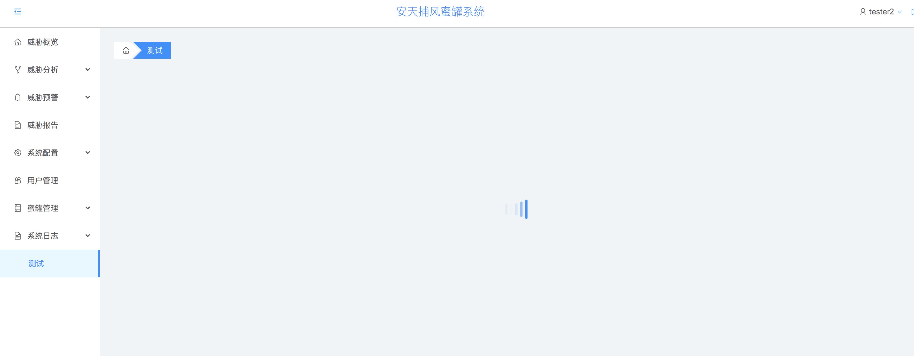
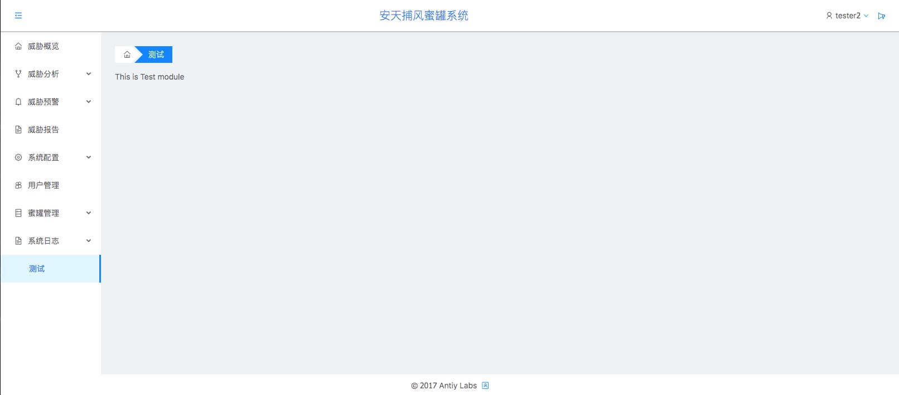

# 如何添加一个路由级别的新模块？

下面例子以一个名字为“测试”的路由作为演示

### step 1 定义路由基础信息
首先要定义好一个路由的名字/URL/是否为隐藏URL（确保路由URL没有冲突）

在```src/routes/config/path.ts```文件内添加一个新的URL常量

```javascript
  ..... //省略代码若干

  SNORT_URL = "/snort",

  FILE_RESTORE = "/file-restore",

  TEST_URL = "/test"
```

在```src/navConfig/index.tsx```中```_navConfig```添加标题和icon等信息


```javascript
import { TEST_URL } from 'routes/config/path'
//记得在文件头先导入常量

const _navConfig=[
  
  ... //省略代码若干

   {
    link:TEST_URL,//url连接

    title:"测试"，//路由标题 决定了侧边栏和面包屑导航显示的名字 

    hidden:false,//如果为隐藏的URL，该值为true，不写默认为false

    //其他内容 请参考 src/navConfig/index.tsx 中已配置的项

}

]

```

此时查看界面 会发现右侧导航栏多了```测试```一栏 




### step 2 添加路由内容

此时发现路由还是处于一个空白加载的状态，那是因为我们还没有添加路由的具体内容，下面就让我们给路由添加一些内容

在```src/modules```文件夹下，新建一个```Test```文件夹，结构如下
(其他文件请自行添加，演示使用，尽量保持简洁)
```
modules
└── Test
    └── index.tsx
```

```index.tsx```

```javascript
import * as React from 'react'

export default class Test extends React.Component<any, any>{
  render() {
    return <div>This is Test module</div>
  }
}
```

来到```src/routes```目录下，添加一个```Test.ts```文件

```javascript
import * as React from 'react'
import dynamic from 'dva/dynamic'
import WithRouteInit from 'domainComponents/WithRouteInit'
import asyncModulePipe from './utils/asyncModulePipe'

export default (app: any, url: string): React.Component => {

  return dynamic({
    app,
    //导入model 具体细节参考已经配置好的其他route
    models: () => [].map(asyncModulePipe),
    
    //按照下面的格式调用 webpackChunkName 为打包后的文件名 ,'modules/Test' 为文件路径 
    component: () => System.import(/* webpackChunkName: "TestPage" */'modules/Test')
      .then(page => WithRouteInit(url)(page.default)),
  })
}
```

在```src/router.tsx```中导入```Test```路由

```javascript
import getTestPage from 'routes/Test'
import {TEST_URL} from 'routes/config/path'

export default ({ history, app }) => {
  return (
    <Router history={history}>
      <LocaleProvider locale={zhCN}>
        <MainWrapper>
          <Switch>
              ...//省略代码若干
            <Route
              exact
              component={getTestPage(app, TEST_URL)}>
            </Route>
          </Switch>
        </MainWrapper>
      </LocaleProvider>
    </Router>
  );
}

```

此时查看页面 ，会看到如下的效果 ,接下去的业务内容请自行发挥




### Step 3 通过app.json控制路由是否加载

打开```config/app.json```文件 ,添加如下配置 ，便可以通过```app.json```来
控制路由是否显示 ，若不在此处配置，则默认为true
```javascript
{
  ...//省略代码若干

  "routerRegister": {
    "/test": false
  },
  ...//省略代码若干
}
```


### 总结 

经过这几步 ，我们一共实现了如下功能
* 新增Test模块
* 路由懒加载
* 能够通过app.json来控制模块是否加载